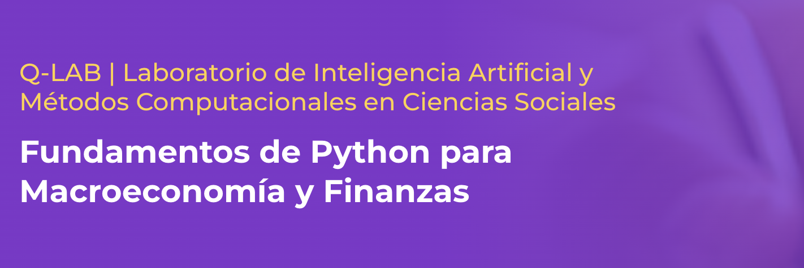

  

## 1.	Información General

| | | 
|:-------------------|---|
| Nombre del curso		|  Fundamentos de Programación en Python para Macroeconomía y Finanzas  | 
| Profesor del curso		|  Víctor Fuentes Campos  | 
| Correo electrónico PUCP	|  vfuentes@pucp.edu.pe| 

## 2. Sumilla

Este curso está diseñado para contribuir al desarrollo de habilidades de programación con Python e incoporarlo como una caja de herramientas para la investigación cuantitativa. El curso está dirigido a estudiantes con poca o sin experiencia en programación, pero que están interesados en aprender como la ciencia de datos convierte datos en conocimiento para la toma de decisiones. El curso cubrirá aspectos básicos de programación en Python, librerías NumPy y Pandas, visualización de datos, web scrapping y APIs.

## 3.	Presentación 

Este curso está dirigido a estudiantes de macroeconomía y finanzas con poca o sin experiencia previa con lenguajes de programación, o que recién han comenzado a utilizar programas estadísticos como STATA y R, y les ha resultado atractiva la interacción con los datos mediante código. El curso busca preparar a los estudiantes para el mercado laboral, al brindar una habilidad altamente demandada, y que será una útil para un primer trabajo o práctica que involucre la ciencia de datos.

## 4. Resultados de aprendizaje

1. Aprender cómo usar GitHub (y posiblemente crear tu sitio web académico o técnico)
1. Comprender conceptos básicos de programación como variables, funciones, loops y condicionales
1. Escribir programas sencillos en Python para resolver problemas reales
1. Comprender y utilizar diversos tipos de datos en Python, incluyendo listas, diccionarios y tuples
1. Utilizar librerías y módulos de Python para realizar tareas como análisis de datos y computación científica
1. Utilizar Python para interactuar con APIs web y extraer información de páginas web (web scraping).

## 5. Metodología

Las 16 horas de clases se desarrollarán de forma síncronica a través de Zoom (ver Paideia). En las aplicaciones de clase se usarán bases de datos vinculadas, en la medida de lo posible, a la macroeconomía y las finanzas.

## 6. Evaluación

La evaluación consiste en cuatro tareas y un trabajo final. Las tareas y los trabajos se desarrollarán en grupos formadas aleatoriamente por el docente de hasta 3 personas. Los grupos rotarán en cada tarea.

| Nº de evaluaciones | Tipo de evaluación  | Peso en la nota final | Plazo de entrega |
|:-------------------:|:---:|:---:|:---:|
| 4 | Tareas | 80% | 48 horas |
| 1 | Trabajo final | 20%| 72 horas |

Las tareas y el trabajo final se asignarán a través de GitHub Classrooms, por lo que es indispensable que todos generen una cuenta de GitHub (ver la sección [9. Recursos adicionales](#10-recursos-adicionales)) y agreguen su usuario en en la columna D del [Google Sheets del curso](https://docs.google.com/spreadsheets/d/10ojj7ahrwSxBl71ykb8tjTXL87VijyUSd2JWWWgyDzo/edit?usp=sharing) .

## 7. Cronograma tentativo

|Fecha|Temas|Subtemas|
|---|---|---|
2 de enero   7pm-10pm |  GitHub & Python  |• Intro • Ramas y repositorios  • Tipos de datos en Python  |
4 de enero   8am-12pm| Listas, tuplas y diccionarios | • Crear   • Modificar   • Objetos de objetos  |
6 de enero   7pm-10pm | Estructuras de control  & Funciones |• Condicionales e iteraciones   • Parámetros   • Anidación  |
8 de enero   7pm-10pm | NumPy & Pandas| • Generar e importar datos   • Transformar datos   • Visualizar de datos  |
10 de enero   7pm-10pm| APIs | • Macro & Finance APIs   |

## 8. Grupos (preliminar)

El docente formará los grupos de manera aleotoria el primer día de clases

| Nº Grupo| Integrante Nº 1 | Integrante Nº 2 |
|---|---|---|
|...| ... | ... |
|...| ... | ... |
|...| ... | ... |

## 9. Recursos adicionales

En adición al material compartido por Paideia:

- Instalar Anaconda (Python y Jupyter): Tutorial de [DataCamp](https://www.datacamp.com/es/tutorial/installing-anaconda-windows) para descarga e instalación. Para [MacOS](https://www.godaddy.com/resources/es/crearweb/anaconda-python-como-configurar-utilizar-plataforma)
- Instalar GitHub: [Crear una cuenta](https://github.com/signup) y luego seguir el [tutorial de GitHub](https://docs.github.com/es/desktop/installing-and-authenticating-to-github-desktop/installing-github-desktop) para instalar GitHub Desktop
- Instalar VSCode: Tutorial de instalación de Microsoft para [Windows](https://code.visualstudio.com/docs/setup/windows) y [MacOS](https://code.visualstudio.com/docs/setup/mac)

## 10. Bibliografía obligatoria

1.	"Python for Data Science Handbook" by Jake VanderPlas (O'Reilly, 2017) 
1.	"Python Crash Course" by Eric Matthes (No Starch Press, 2015) 
1.	"Python for Everyone" by Horstmann and Reed (Wiley, 2015)
1.  "Think Python: How to Think Like a Computer Scientist (2nd ed.)" by Allen Downey (O'Reilly, 2015)

